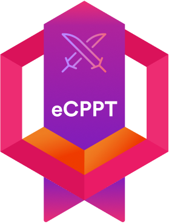
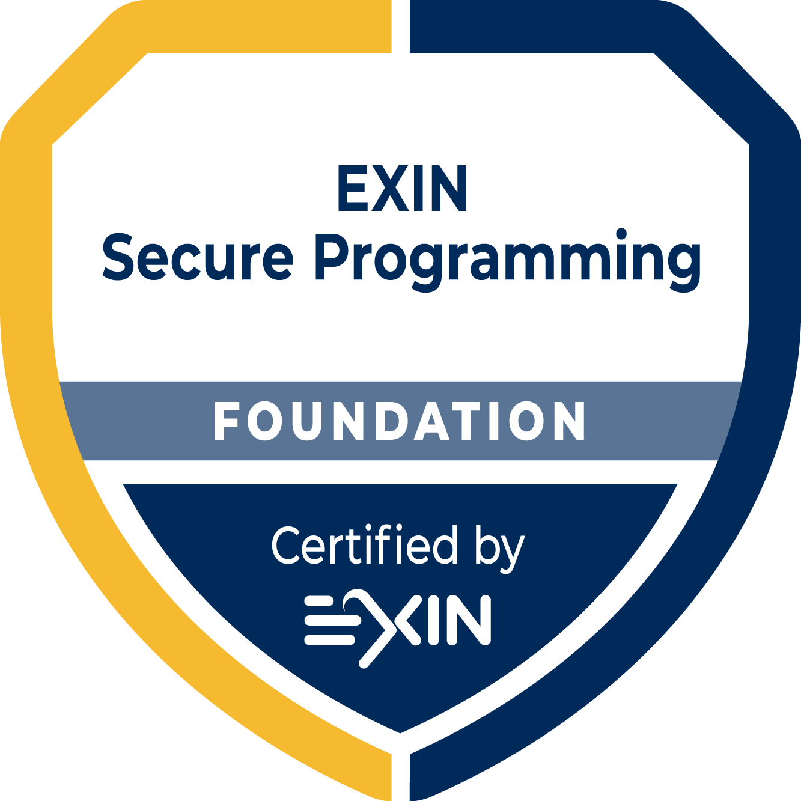
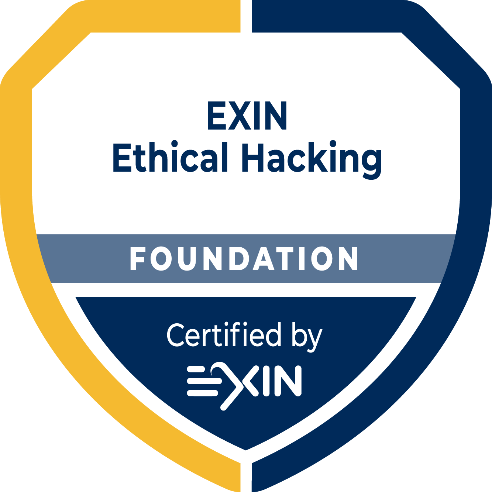

    
<b>Eduardo Vasconcelos</b>

    
Application Security Engineer

    

        
        
        
    

    <a href="https://github.com/vasconcedu">
        <button style="background-image: linear-gradient(rgb(18, 31, 40), rgb(36, 61, 80)); color: white; border-radius: 16px;"><small>GitHub</small></button>
    </a>
    <a href="https://www.linkedin.com/in/vasconcedu/">
        <button style="background-image: linear-gradient(rgb(18, 31, 40), rgb(36, 61, 80)); color: white; border-radius: 16px;"><small>LinkedIn</small></button>
    </a>
    <!-- <a href="#">
        <button style="background-image: linear-gradient(rgb(18, 31, 40), rgb(36, 61, 80)); color: white; border-radius: 16px;"><small>Website</small></button>
    </a> -->
    <!-- <a href="#">
        <button style="background-image: linear-gradient(rgb(18, 31, 40), rgb(36, 61, 80)); color: white; border-radius: 16px;"><small>E-mail</small></button>
    </a> -->

## Key Highlights

- 7+ years of experience in the software industry with emphasis on Application Security;
- Software Engineering postgraduate researcher awarded for national-level excellence in 2024;
- Computer Engineering graduate awarded for university-level excellence in 2016;
- Creative and fast learner with a proven ability to leverage and apply knowledge across a wide range of technologies and environments;
- Proficient in three languages: Portuguese (native), English <small>IELTS: C1</small>, and French <small>TCF: B2-C1</small>.

## Skills Matrix 

| Level        | Application Security | Complementary |
|--------------|----------------------|---------------|
| Advanced     | <ul style="list-style-type: none; padding: 0; margin: 0;"><li>Threat Modeling</li><li>Security Engineering</li><li>Penetration Testing</li><li>Vulnerability Assessment</li><li>Security Code Review</li></ul> |<ul style="list-style-type: none; padding: 0; margin: 0;"><li>Research & Development</li></ul> |
| Intermediate | <ul style="list-style-type: none; padding: 0; margin: 0;"><li>Security Awareness</li><li>Reverse Engineering</li><li>Cryptography</li></ul> | <ul style="list-style-type: none; padding: 0; margin: 0;"><li>Full Stack Development</li></ul> |
| Familiar     | <ul style="list-style-type: none; padding: 0; margin: 0;"><li>DevSecOps</li><li>Incident Response</li></ul> | <ul style="list-style-type: none; padding: 0; margin: 0;"><li>Machine Learning</li></ul> |

## Tech Stack

- Backend: Django, FastAPI;
- Frontend: React, Bootstrap;
- Database: PostgreSQL, SQLite, MongoDB;
- Other: Android (Java, Kotlin), Android NDK (C/C++), GitLab CI/CD, Docker, AWS.

## Work History

- **Master Application Security Architect** @ SiDi, Brazil (remote) 
    Aug 2024 &mdash; Present

    - Conducted threat modeling, security architecture reviews, and assessments for Android and web applications, including Samsung Wallet and Knox;
    - Collaborated closely with development teams to integrate security into the Software Development Life Cycle (SDLC) and anticipate vulnerabilities.

- **Senior Mobile Security Engineer** @ iFood, Brazil (remote) 
    Feb 2022 &mdash; Aug 2024 

    - Designed and implemented security and fraud prevention mechanisms for mission-critical Android and iOS applications with over 40 million active monthly users;
    - Reverse engineered malicious Android apps to reveal methods and behaviors used by fraudsters in food delivery services;
    - Integrated Runtime Application Self-Protection (RASP) solutions into GitLab CI/CD pipelines for mobile apps.

- **Senior Software Security Analyst** @ SiDi, Brazil 
    Apr 2019 &mdash; Feb 2022 

    - Delivered ongoing offensive security testing services to Samsung, emphasizing application security for Android and web applications;
    - Conducted research on Android API and OS vulnerabilities on behalf of Samsung, including issues related to Android accessibility service abuses and permission circumvention.

- **Information Security Analyst** @ Hacker Rangers, Brazil 
    Jun 2017 &mdash; Apr 2019 

    - Delivered comprehensive services in web application and network security assessments, as well as phishing campaigns;
    - Developed, maintained, and administered Hacker Rangers, a SaaS cybersecurity awareness platform;
    - Installed, configured, provided training for, and managed IBM Security Guardium database audit and protection virtual appliances, supporting both private organizations and government agencies.

- **Information Technology Intern** @ Embraer, Brazil 
    Sep 2016 &mdash; Jun 2017 

    - Contributed to the development of an IT Change Management plan;
    - Conducted analyses of corporate web traffic.

- **Engineering Intern** @ SigMEDIA, Ireland 
    May 2014 &mdash; Jul 2014 

    - Developed a machine learning model designed to detect laughter in human speech;
    - Processed digital voice signals to train the model.

## Education 

- **Master's Degree in Computer Science** @ USP, Brazil 
    Feb 2022 &mdash; Present

    - Research topic: leveraging mutation testing techniques to inject vulnerabilities into Android apps, providing a novel approach to evaluating mobile security testing procedures;
    - Received the Distinguished Paper Award at the Brazilian Conference on Software 2024 (CBSOFT'24) for my work, "Mutation Testing to Support the Security Testing of Android Applications.";
    - Served as a teaching assistant for Software Engineering.

- **Postgraduate Diploma in Software Engineering** @ Unicamp, Brazil 
    Feb 2019 &mdash; Dec 2019

    - One-year Postgraduate Diploma program in Software Engineering, covering a range of disciplines within the field, including software design, development, testing, and project management;
    - Graduated with a GPA of 9.4 out of 10.0.

- **Engineer's Degree in Computer Engineering** @ USP, Brazil 
    Feb 2012 &mdash; Jul 2017

    - Awarded the Sao Paulo Research Foundation (FAPESP) undergraduate research scholarship, contributing to a research project focused on flood forecasting in urban areas;
    - Received the Best Computer Engineering Undergraduate Thesis Award in 2016 for my work on emotion recognition in human speech using Machine Learning;
    - Graduated 13th out of 59 with a GPA of 7.5 out of 10.0;
    - Served as a teaching assistant for Python Programming;
    - Served as a teaching assistant for Object-Oriented Programming;
    - Volunteered as a junior enterprise web developer.

- **Visiting Student in Electronic Engineering** @ TCD, Ireland 
    Sep 2013 &mdash; May 2014
    
    - Awarded the Brazilian Federal Government's "Science without Borders" (SwB) scholarship;
    - Served as a full-term visiting student, earning 60 ECTS with honors;
    - Received a Special Prize for the Best Product Branding Video at the Trinity Engineering Student Entrepreneurs of the Year Competition in 2014.

- **Professional Training in Computer Hardware and Network Maintenance** @ Microlins, Brazil 
    Mar 2007 &mdash; Sep 2007 

    - Six-month professional training program in computer hardware, operating systems and computer networks.